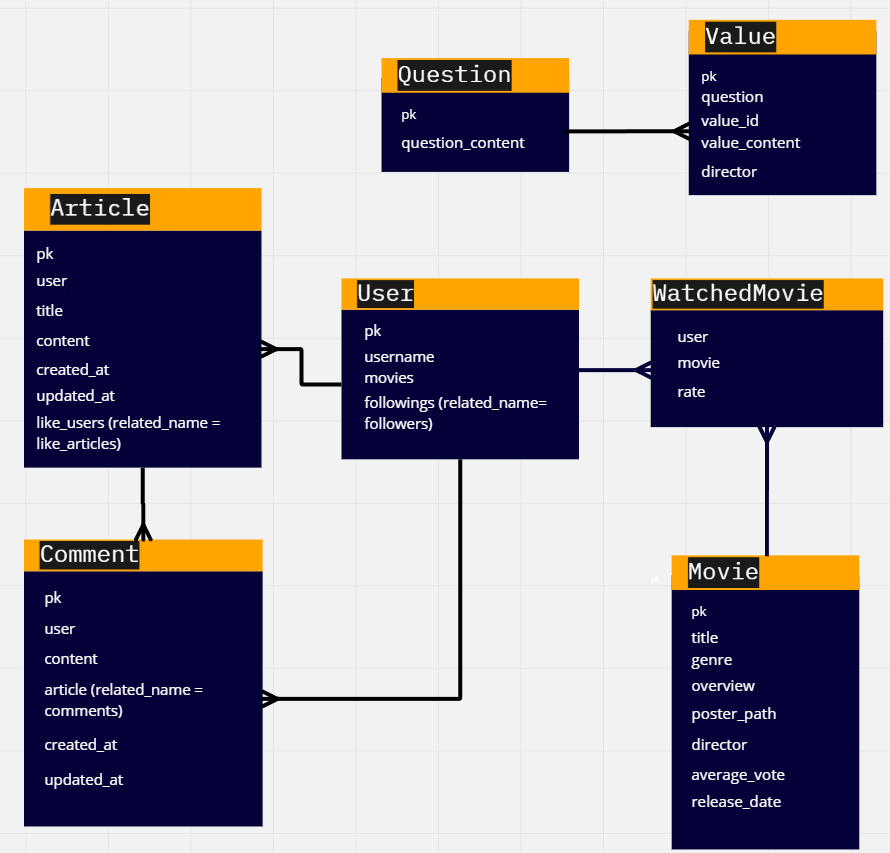
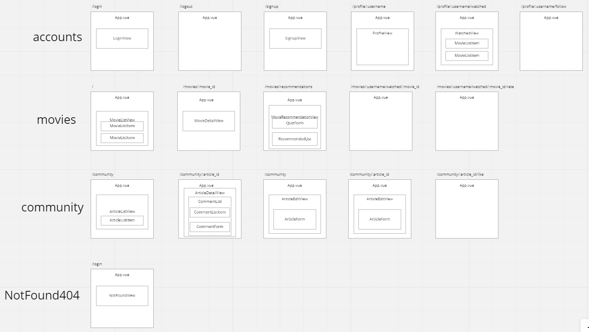

# MOODLE, 당신만의 영화 감독을 찾아보세요!

- 삼성 청년 SW아카데미 관통프로젝트 최우수상🏆
- 2022년 5월 17일 ~ 2022년 5월 26일


## 목차

1️⃣ <a href="#1️⃣-개요">개요</a>

2️⃣ <a href="#2️⃣-기술스택--기여도">기술스택 & 기여도</a>

3️⃣ <a href="#3️⃣-설계">설계</a>

4️⃣ <a href="#4️⃣-시연">시연</a>

5️⃣ <a href="#5️⃣-개발자">개발자</a>

6️⃣ <a href="#6️⃣-회고">회고</a>


<br>

## 1️⃣ 개요

- TMDB API를 이용해 영화 정보를 불러와 영화 데이터를 사용자에게 보여주고 추천도 해줘요!
- 간단한 퀴즈를 읽고 해당하는 보기를 고르면 당신과 비슷한 성향의 감독을 찾아드립니다!
- 나와 가장 닮은 감독의 영화 중 내 취향에 딱 맞는 영화를 추천해드려요!
- 추천 받은 영화를 감상하면 커뮤니티에서 다른 사람과 함께 영화에 대한 이야기를 나눠보세요~

<br>

## 2️⃣ 기술스택 & 기여도

### 🔸 기술스택

<span>


</span>
<br>
<span>


</span>
<br>
<span>


</span>
<br>
<span>


</span>
<br>
<span>

</span>

<br>

### 🔸 기여도 (Back-End)

<span>


</span>

<br>

<span>


</span>

<br>

<span>

</span>

#### ◼ 기획

#### ◼ 설계

◽ ERD 작성

◽ Components 설계

◽ Routes 설계

#### ◼ 개발

◽ REST API 구축

◽ Open API 활용

◽ DB 관리

◽ 영화 추천 알고리즘

<br>

## 3️⃣ 설계

### 🔸 ERD



### 🔸 Components & Routes 구조



<br>

## 4️⃣ 시연

### 👇Click!

[](https://youtu.be/ALXX5F6ty6w) 

0:00 - 메인페이지 & 상세페이지

0:18 - 로그인

0:25 - 영화 평점 기능

0:44 - 프로필 화면

0:56 - 회원가입

1:08 - 사용자들의 평균 평점 제공

1:26 - 커뮤니티 기능

2:13 - 팔로우 기능

2:17 - 영화 추천 서비스 기능

<br>

## 5️⃣ 개발자

| 이름 | 역할 |
| --- | --- |
| 👩마주리 | Front-End |
| 👨이종은 (me) | Back-End |

<br>

## 6️⃣ 회고

### 🔸 핵심기능

<details>
  <summary><h4>TMDB API로 받아온 영화 정보 DB에 저장하기</h4></summary>
  
```python
    genres_dict = {
        28: '액션',
        12: '모험',
        16: '애니메이션',
        35: '코미디',
        80: '범죄',
        99: '다큐멘터리',
        18: '드라마',
        10751: '가족',
        14: '판타지',
        36: '역사',
        27: '공포',
        10402: '음악',
        9648: '미스테리',
        10749: '로맨스',
        878: 'SF',
        53: '스릴러',
        10752: '전쟁',
        37: '서부',
    }
    
    @api_view(['GET'])
    @permission_classes([AllowAny])
    def movie_list(request):
    
        URL = 'https://api.themoviedb.org/3'  
        api_key = '발급 받은 API_KEY'
        params = {
            'api_key': api_key,
            'language': 'ko-KR',
            'region': 'KR',
        }
    
        GET_MOVIES_PATHS_DICT = {
            'now_playing': '/movie/now_playing',
            'upcoming': '/movie/upcoming',
            'popular': '/movie/popular',
        }
    
        res = {}
    
        for GET_MOVIES_PATH_NAME, GET_MOVIES_PATH in GET_MOVIES_PATHS_DICT.items():
            response_movies = requests.get(URL+GET_MOVIES_PATH, params=params)
            response_movies_json = response_movies.json()
            movies_data = response_movies_json['results']
    
            movies = []
            for movie_data in movies_data:
    
                serializer = MovieValidationSerializer(data=movie_data)
                if serializer.is_valid():
                    if not Movie.objects.filter(title=movie_data['title']).exists():
                    
                        # 장르 id => 한글화 작업
                        genres_datas = movie_data['genre_ids']
                        movie_genres = []
                        for genre_data in genres_datas:
                            if genres_dict[genre_data]:
                                movie_genres.append(genres_dict[genre_data])
                        
                        # list객체 JSON화 => 추후 필드에 저장 & 파싱해서 사용
                        movie_genres_json = json.dumps(movie_genres)
    
                        # movie의 id값으로 TMDB credits path 요청해서 감독 이름 구하기
                        GET_CREDITS_PATH = f'/movie/{movie_data["id"]}/credits'
                        response_credits = requests.get(URL+GET_CREDITS_PATH, params=params)
                        response_credits_json = response_credits.json()
    
                        # 영화 제작자 명단인 credits의 속성 crew의 값을 변수화 => crews_data
                        crews_data = response_credits_json['crew']
    
                        # 직책이 Directing인 crew의 이름을 director 필드에 저장
                        for crew_data in crews_data:
                            if crew_data['department'] == 'Directing':
                                movie_director = crew_data['name']
                                break
                        
                        serializer.save(genre=movie_genres_json, director=movie_director)
        
                    movie = get_object_or_404(Movie, title=movie_data['title'])
                    serializer = MovieDetailSerializer(movie)
                    movies.append(serializer.data)
            
    				# 현재상영작, 개봉예정, 인기작이 담긴 딕셔너리 요소 3개가 담겨서 한 번에 응답
            res[GET_MOVIES_PATH_NAME] = movies
    
        return Response(res)
        
```
    
</details>

<details>
  <summary><h4>사용자가 제출한 설문 결과를 기반으로 비슷한 성향의 영화 감독 찾기</h4></summary>
  
```python
@api_view(['GET', 'POST'])
    def movie_recommendations(request):
    		
    		# 퀴즈를 진행하기 위한 문항&보기 응답
        if request.method == 'GET':
            quizzes = Question.objects.all()
            serializer = QuestionSerializer(quizzes, many=True)
            return Response(serializer.data)
    		
    		# 제출한 퀴즈 결과를 기반으로 비슷한 성향의 영화 감독 찾기
        elif request.method == 'POST':
            # results = request.data['results']
            
            results = []
            for value_id in request.data:
                value = get_object_or_404(Value, id=value_id)
                results.append(value.director)
    
            recommendable_director = max(set(results), key=results.count)
            director_movies = Movie.objects.all().filter(director=recommendable_director)
```
    
</details>

<details>
  <summary><h4>비슷한 성향의 영화 감독 작품 중에서 사용자가 많이 본 장르의 영화 추천하기</h4></summary>
  
```python
@api_view(['GET', 'POST'])
def movie_recommendations(request):

        # 퀴즈를 진행하기 위한 문항&보기 응답
    if request.method == 'GET':

                # ...

        # 제출한 퀴즈 결과를 기반으로 비슷한 성향의 영화 감독 찾기
    elif request.method == 'POST':

                # ...

                user_genres = {
                    '액션': 0,
                    '모험': 0,
                    '애니메이션': 0,
                    '코미디': 0,
                    '범죄': 0,
                    '다큐멘터리': 0,
                    '드라마': 0,
                    '가족': 0,
                    '판타지': 0,
                    '역사': 0,
                    '공포': 0,
                    '음악': 0,
                    '미스테리': 0,
                    '로맨스': 0,
                    'SF': 0,
                    '스릴러': 0,
                    '전쟁': 0,
                    '서부': 0,
                }

                # JSON 파싱도구
                jsonDec = json.decoder.JSONDecoder()

                movies = request.user.movies.all()

                # 사용자가 본 영화를 순회 => 각 영화의 장르를 파싱 => user_genres에 카운트
                for movie in movies:
                    genres = jsonDec.decode(movie.genre)
                    for genre in genres:
                        user_genres[genre] += 1

                # user_genres의 value가 있는 값만(사용자가 본 장르만) 튜플 형태(장르, 카운트)로 리스트에 담고, 카운트값 기준으로 내림차순
                favorite_genres = sorted(list(filter(lambda x: x[1], user_genres.items())), key=lambda x: x[1], reverse=True)

                # 사용자가 많이 본 장르 기반으로 추천 감독의 해당 장르 영화가 있는 지 탐색 
                for favorite_genre in favorite_genres:
                    if director_movies.filter(genre__contains=favorite_genre[0]).exists():
                        recommendable_movie = director_movies.filter(genre__contains=favorite_genre[0]).order_by('?').first()
                        break

                # 추천 감독의 작품 중에 사용자가 본 장르가 없다면 감독의 전체 작품 중에서 랜덤 
                else:
                    recommendable_movie = director_movies.order_by('?').first()

                serializer = MovieDetailSerializer(recommendable_movie)
                return Response(serializer.data)
```
    
</details>

    
<br>

### 🔸 문제해결

<details>
  <summary><h4>sqlite3 리스트 필드 저장하기</h4></summary>
  
```python
# list객체 JSON화해서 필드에 저장, 추후 파싱해서 사용
movie_genres_json = json.dumps(movie_genres)
```
    
</details>

<details>
  <summary><h4>한 번의 요청으로 3 개의 Open API 응답을 DB에 저장하고, 3 가지를 구분해서 사용자에게 응답하기</h4></summary>
  
각 Open API의 path를 반복문으로 돌면서 DB에 data를 저장하고, 저장이 끝나면 DB에서 해당 영화가 가진 유일한 속성-값으로 바로 찾아내 빈 리스트에 차곡차곡 채워 최종 응답으로 보낼 딕셔너리에 저장한다.
    
```python
GET_MOVIES_PATHS_DICT = {
    'now_playing': '/movie/now_playing',
    'upcoming': '/movie/upcoming',
    'popular': '/movie/popular',
}

res = {}

for GET_MOVIES_PATH_NAME, GET_MOVIES_PATH in GET_MOVIES_PATHS_DICT.items():
    response_movies = requests.get(URL+GET_MOVIES_PATH, params=params)
    response_movies_json = response_movies.json()
    movies_data = response_movies_json['results']

    movies = []
    for movie_data in movies_data:

        serializer = MovieValidationSerializer(data=movie_data)
        if serializer.is_valid():
            if not Movie.objects.filter(title=movie_data['title']).exists():

                # 장르 id => 한글화 작업
                genres_datas = movie_data['genre_ids']
                movie_genres = []
                for genre_data in genres_datas:
                    if genres_dict[genre_data]:
                        movie_genres.append(genres_dict[genre_data])

                # list객체 JSON화해서 필드에 저장, 추후 파싱해서 사용
                movie_genres_json = json.dumps(movie_genres)

                # movie의 id값으로 TMDB credits path 요청해서 감독 이름 구하기
                GET_CREDITS_PATH = f'/movie/{movie_data["id"]}/credits'
                response_credits = requests.get(URL+GET_CREDITS_PATH, params=params)
                response_credits_json = response_credits.json()

                # 영화 제작자 명단인 credits의 crew값을 변수화 => crews_data
                crews_data = response_credits_json['crew']

                # 직책이 Directing인 crew의 이름을 director 필드에 저장
                for crew_data in crews_data:
                    if crew_data['department'] == 'Directing':
                        movie_director = crew_data['name']
                        break

                serializer.save(genre=movie_genres_json, director=movie_director)

            movie = get_object_or_404(Movie, title=movie_data['title'])
            serializer = MovieDetailSerializer(movie)
            movies.append(serializer.data)

    res[GET_MOVIES_PATH_NAME] = movies

return Response(res)
```
    
</details>

    
<br>

### 🔸 아쉬운점

<details>
  <summary><h4>커뮤니티 이미지 업로드 기능</h4></summary>
  커뮤니티에 게시글을 올릴 때 오직 글만 올라갈 수 있어서 이미지도 추가해서 좀 더 다양한 정보들이 오갈 수 있도록 개선하면 좋을 것 같다.
</details>

<details>
  <summary><h4>맞팔로우 방명록 기능</h4></summary>
  어느 기관에서 조사한 결과에 따르면 사람들은 SNS나 지인으로부터 영화 추천받는 것을 선호한다고 한다. 사용자의 프로필과 팔로우 기능을 구현한 만큼, 서로의 프로필 페이지에서 방명록 기능을 추가하면 사용자들끼리 영화 추천을 보다 적극적으로 이끌어 낼 수 있을 것이라 생각이 든다.
</details>

<a href="#moodle-당신만의-영화-감독을-찾아보세요">⏏맨 위로</a>
