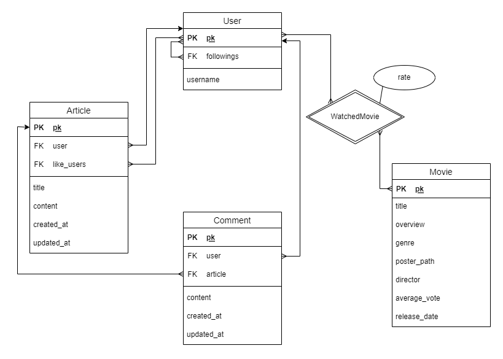
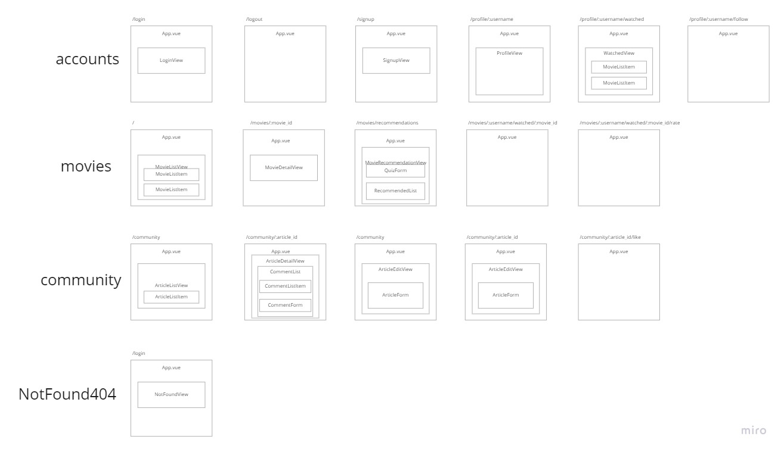
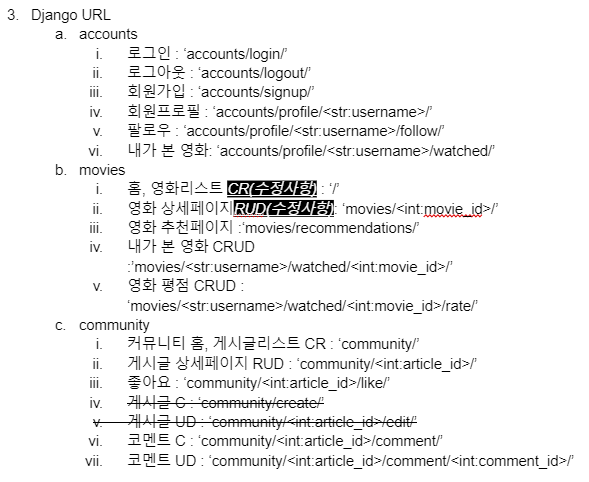

# Final PJT _마주리

### 2022-05-17 (화)

* 오늘은 final pjt를 함께 할 페어가 종은님으로 정해진 날이었다.

#### 1. 프로젝트 명세서 작성

* final pjt의 첫 번째 날인만큼, 주어진 명세서를 읽어보고 종은님과 함께 추가적으로 정의할 요구사항들을 우선 작성했다.

* 영화 추천 알고리즘은 고민을 많이 했는데, 사용자가 관람한 영화를 기반으로 한 기본적인 알고리즘에 더하여 추가적인 응답 문항을 통해 감독을 기반으로 한 영화 추천 알고리즘을 더해보기로 하였다.


#### 2. ERD 모델링

* 정의한 요구사항에 맞추어 ERD를 작성하였다.

* 까다로웠던 부분은, 사용자별로 관람한 영화의 평점을 매기는 부분이었다. 각 사용자가 매긴 평점에 따라 영화 별 평균 평점이 나올 수 있도록 해야했기 때문에, 사용자(User)개체와 영화(Movie)개체의 관계속에 새로운 속성인 평점(rate)을 추가해야 했다.

  


#### 3. RDB 설계

* ERD를 바탕으로 RDB를 설계했다.


---

### 2022-05-18 (수)

* 오늘은 약 1시간 정도 프로젝트를 할 시간이 생겨서 종은님과 함께 추천 알고리즘에 대해서 조금 더 구체화를 시켜보았다.
* 감독 기반의 추천 알고리즘을 위해서 사용자에게 보여줄 퀴즈 문항과 관련된 감독에 대한 정보를 저장할 model을 추가적으로 생성하기로 하였다.
* 프로젝트에서 사용될 URL을 정리하였고, 필요한 Vue Components 구조를 적어보았다.

---

### 2022-05-19 (목)

* 오늘은 추천 알고리즘을 위한 추가적인 `Question` 모델과 `Value` 모델을 작성하였다.

* DB 모델링을 어떻게 하는 것이 효율적인지 많은 고민을 했었던 것 같다. DB의 일관성을 유지하면서 우리가 기존에 구상했던 추천 알고리즘을 구현하기 위한 최적의(?) 모델링을 하기 위해서 종은님과 많은 이야기를 나누었다. 

* 어제 작성했던 Vue Components 구조를 토대로 다이어그램을 작성하였다.

  

* DB 모델링과 Vue Components 구조가 세워지고 난 후, 직접 Django에서 프로젝트를 생성하고`Models.py`를 작성한 뒤 `shell`을 사용하여서 모델링이 잘 되었는지를 확인했다. 가장 걱정했던 부분은 `User`와 `Movie` 개체의 관계인 `WatchedMovie`(내가 본 영화) 테이블이었다. `shell_plus`를 통해서 데이터를 직접 생성해보고 ORM을 작성해보면서 원하는 대로 작동하는 것을 보고 굉장히 뿌듯했다 😉
* 어제 작성한 URL과 Components 구조를 기반으로 하여서 Vue의 Router와 Component를 생성하였다. 그리고 Django와의 통신을 위해서 통신을 위한 URL을 모두 `drf.js`라는 파일에 작성하였다. 이 파일은 `/src`에 `api`라는 디렉토리를 생성하고 그 안에 저장하였다.
* Django에서 사용될 URL을 적다보니 이전에 작성한 명세에서 Restful하지 못하게 작성한 부분을 종은님께서 발견하였다. 그래서 부족한 부분들을 보완하는 것으로 오늘의 협업은 마무리가 되었다!



---

### 2022-05-20 (금)

* 어제 작성한 url를 이용해서 오늘은 서버와 통신하는 과정을 진행했다.

* **Backend**

  * 다른 출처의 리소스를 불러오기를 가능하게 하기 위해서 우선 `CORS`를 설정하고, Authentication & Authorization 기능을 위해서 `Django Rest Framework`의 auth도 설정했다.

  * `'/'` 으로 클라이언트에서 GET 요청이 왔을 때는 DB에 저장되어 있는 데이터를 응답해주고, POST 요청이 왔을 때는 TMDB API에서 영화를 새롭게 받아와 DB에 저장하고 저장한 데이터를 응답해주게끔 하였다.

  * `Admin user`만 POST 요청을 보낼 수 있게끔 하기 위해서 POST 요청을 받는 views.py의 함수에는 추가 데코레이터를 작성하였다. 아래와 같은 방식!

    ```python
    @api_view(['POST'])
    @permission_classes([IsAdminUser])
    def movie_create(request):
        pass
    ```

    

* **Frontend**

  * 우선 `@/store/modules/movies.js`를 작성한 뒤, 영화리스트를 보여주는 MovieListView와 영화 상세페이지를 보여주는 MovieDetailView를 작성했다.
  * 영화의 상세페이지로 넘어갈 때 movie 객체의 pk 값을 통해서 새로운 url로 라우팅 되도록 작성하였는데, 계속해서 pk 값을 정상적으로 읽어오지 못했다. pk가 아니라 id로 바꾸니 해결.
  * 관리자 권한으로 인정된 사용자만 `'/'`으로 POST 요청을 보낼 수 있게 하기 위해서 회원가입, 로그인, 로그아웃 기능이 구현되어야 했다. 해당 기능들을 다음으로 할 목표들로 정해두고 오늘도 하루가 마무리 되었다.


---

### 2022-05-21(토)

* 영화 데이터 받아오기 고도화..?

* **Backend**

  * 시간의 흐름에 따라서 현재상영작, 상영예정작, 인기영화에 담겨있는 영화가 달라질 수 있어`/`에 GET 요청을 받을 때마다 TMDB API를 받아와 새로운 데이터를 응답할 수 있도록 하였고, POST요청이 오면 전달받은 data를 키워드로 TMDB에서 검색한 결과를 받아 DB에 저장한 뒤 정상적으로 저장되었을 때 201 응답 상태를 보내도록 했다.
  * serializer를 사용해서 API를 통해 받은 데이터 중 유효한 데이터만 DB에 저장될 수 있도록 했다. 

  

* **Frontend**

  * 어제 조금 작성해두었던 코드에 이어서 회원가입, 로그인, 로그아웃 기능을 모두 구현하였다.
  * 현재 사용자(currentUser)에 대한 정보를 받아오는 데 django에 추가적인 url를 작성해야 하는지 헷갈렸었는데, `accounts/user/`로 요청을 보내면 정상적으로 응답이 도착했다. 라이브러리에 모두 들어있는 기능이었다 ㅎㅎ
  * 오늘은 TMDB에서 현재상영작, 상영예정작, 인기영화으로 나누어더 많은 영화를 구분지어서 받아오는 작업을 했다. 어제 작성했던 `store`의 `movies.js`를 추가적으로 수정을 진행했다.
  * 시간의 흐름에 따라서 현재상영작, 상영예정작, 인기영화에 담겨있는 영화가 달라질 수 있어`/`에 GET 요청을 보낼 때마다 TMDB API를 받아 온 새로운 데이터를 저장하고, POST 요청을 보낼 땐 관리자 권한의 사용자로부터 입력받은 키워드를 함께 보내고, 해당 키워드로 검색된 영화를 DB에 성공적으로 저장되었다는 201 응답을 받으면 알림창을 띄우도록 변경하기로 했다. *(fetchMoviesSearch, fetchMovies)*
  * 사용자로부터 키워드를 입력받고 submit하는 이벤트에서 `preventdefault`를 하지 않아 페이지가 새로고침되고 DB에 정상적으로 저장되었다는 알림창이 제대로 나타나지 않았다. `input` 태그에 `@submit.prevent`로 작성하여 해결.
  * `'/'`에 GET 요청을 보낼 때마다 TMDB에서 데이터를 새롭게 받아오다보니 페이지에 들어왔을 때 영화 데이터가 보여지는 데까지 꽤 긴 시간이 걸렸다. 그래서 state에 저장된 데이터를 우선 보여주도록 하였다. `vuex-persistedstate`를 설치하여 페이지가 새로고침되어도 `state`가 날아가지 않도록 한 뒤, `created()`에 서버에 GET요청을 보내는 함수를 실행시켰다.
  * `vuex-persistedstate`를 활용해서 local storage에 저장된 내용을 사용하려 할 때는`JSON.parse`가 필수적이다! local storage에 객체를 저장할 때는 `JSON.stringify` !

---

### 2022-05-22 (일)

* 회원가입과 로그인 페이지의 스타일을 작성했다.
* community 에 작성될 게시글(article)과 댓글(comment) 관련한 front 코드를 작성했다.
* serializer에서 pk를 보내주지 않고 id로 값이 들어와 예상하지 못했던 문제가 발생했었는데, 삽질을 통해 결국 잘 해결했다. 
* comment를 새로 작성했을 때 서버에서 새로 작성한 댓글의 유효성을 검사한 후 해당 댓글만 응답으로 보내주어서 댓글 리스트가 보이지 않았다.. 내일 해결해야지.

---

### 2022-05-23 (월)

* 오늘은 정말 많은 것을 한 날이었다. UI 구상과 추천 알고리즘에 대한 이야기를 나누기 위해서 오후시간을 직접 만나서 프로젝트를 진행했다. 대면으로 하다보니 의사소통이 훨씬 편해지는 느낌적인 느낌..? 다시 한 번 말하지만 오늘 굉장히 많은 것을 해냈다.

* 우선 community의 모든 기능 구현을 완성하였다. 여러가지 오류가 있었지만 종은님과 함께 열심히 의견을 나누어 가며 해결.

* 아래와 같이 django에서 url의 통일감을 위해서 `accounts/urls.py`에서 접두어?로 있던 `profile/'을 모두 삭제했다.

  ```python
  # final_pjt/urls.py
  ...
  urlpatterns = [
      path('admin/', admin.site.urls),
      path('', include('movies.urls')),
      path('accounts/', include('accounts.urls')),
      path('accounts/', include('dj_rest_auth.urls')),
      path('accounts/signup/', include('dj_rest_auth.registration.urls')),
      path('community/', include('articles.urls')),
  ]
  ```

  ```python
  # accounts/urls.py
  ...
  urlpatterns = [
      path('', views.article_list_or_create),
      path('<int:article_id>/', views.article_detail_or_update_or_delete),
      path('<int:article_id>/like/', views.article_like_or_cancel),
      path('<int:article_id>/comment/', views.comment_create),
      path('<int:article_id>/comment/<int:comment_id>/', views.comment_update_or_delete),
  ]
  ```

  그랬더니 `urlpatterns`에 적힌 순서대로 라우팅이 되어서 로그인과 로그아웃 기능을 수행하는 url이 정상적으로 동작하지 않았다. 따라서 authentication 관련 기능을 수행하는 `dj_rest_auth`이 포함된 `path`를 모두 상단으로 위치하게 하여서 해결했다.

* 영화를 보여주는 `movies`, 사용자들의 게시글과 댓글을 보여주는 `articles`, 사용자 인증 및 권한을 담당하는 `accounts`의 구현이 어느정도 마무리되어서 오늘은 UI를 구체적으로 구상해보기로 했다.

* 여러 레퍼런스를 보면서 UI의 방향을 종은님과 합의?하고, 별점 등 구체적인 방식을 이야기 나누었다.

* 마지막으로 추천 알고리즘에 대해서 이야기를 나누었다. 우리가 구상했던 추천 알고리즘은 감독에 대한 비하인드와 관련하여 퀴즈를 만들고, 사용자가 선택한 결과에 따라 감독이 선정된다. 그리고 사용자가 본 영화의 장르 선호도를 가져와, 선택된 감독의 영화 중 사용자의 장르 선호도가 가장 높은 장르의 영화를 추천해 주는 것이었다. 감독들에 대한 리스트업을 굉장히 많이 했었지만 일단 구현이 우선이라고 판단, 감독의 수를 대폭 줄이기로 했는데, 이후 확장성을 위해 총 3명의 감독에 대한 6가지 질문을 만들기로 했다. 서버와 클라이언트가 주고받아야 할 데이터에 대해서도 상세히 이야기를 나누었다. 

* 오늘도 정말 알찬 하루였다.....💦
