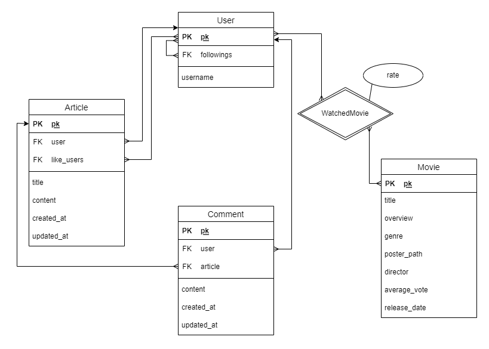
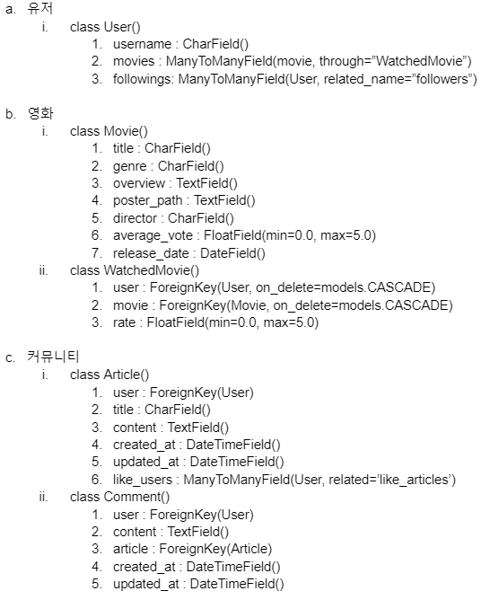
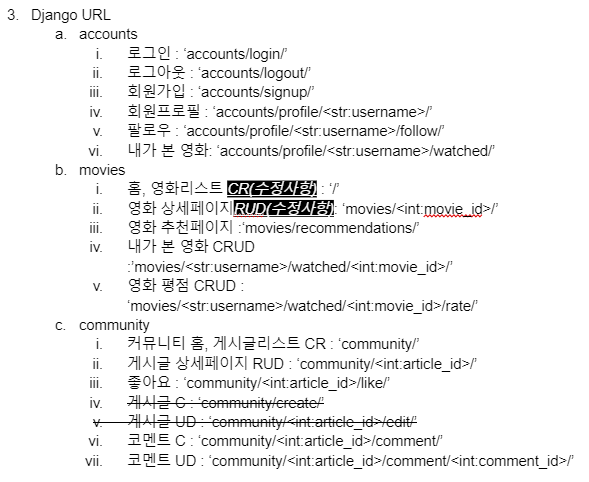

# Final PJT _마주리

### 2022-05-17 (화)

* 오늘은 final pjt를 함께 할 페어가 종은님으로 정해진 날이었다.

#### 1. 프로젝트 명세서 작성

* final pjt의 첫 번째 날인만큼, 주어진 명세서를 읽어보고 종은님과 함께 추가적으로 정의할 요구사항들을 우선 작성했다.g

* 영화 추천 알고리즘은 고민을 많이 했는데, 사용자가 관람한 영화를 기반으로 한 기본적인 알고리즘에 더하여 추가적인 응답 문항을 통해 감독을 기반으로 한 영화 추천 알고리즘을 더해보기로 하였다.

#### 2. ERD 모델링

* 정의한 요구사항에 맞추어 ERD를 작성하였다.

* 까다로웠던 부분은, 사용자별로 관람한 영화의 평점을 매기는 부분이었다. 각 사용자가 매긴 평점에 따라 영화 별 평균 평점이 나올 수 있도록 해야했기 때문에, 사용자(User)개체와 영화(Movie)개체의 관계속에 새로운 속성인 평점(rate)을 추가해야 했다.

  

#### 3. RDB 설계

* ERD를 바탕으로 RDB를 설계했다.

---

### 2022-05-18 (수)

* 오늘은 약 1시간 정도 프로젝트를 할 시간이 생겨서 종은님과 함께 추천 알고리즘에 대해서 조금 더 구체화를 시켜보았다.
* 감독 기반의 추천 알고리즘을 위해서 사용자에게 보여줄 퀴즈 문항과 관련된 감독에 대한 정보를 저장할 model을 추가적으로 생성하기로 하였다.
* 프로젝트에서 사용될 URL을 정리하였고, 필요한 Vue Components 구조를 적어보았다.

---

### 2022-05-19 (목)

* 오늘은 추천 알고리즘을 위한 추가적인 `Question` 모델과 `Value` 모델을 작성하였다.

* DB 모델링을 어떻게 하는 것이 효율적인지 많은 고민을 했었던 것 같다. DB의 일관성을 유지하면서 우리가 기존에 구상했던 추천 알고리즘을 구현하기 위한 최적의(?) 모델링을 하기 위해서 종은님과 많은 이야기를 나누었다. 

* 어제 작성했던 Vue Components 구조를 토대로 다이어그램을 작성하였다.

  

* DB 모델링과 Vue Components 구조가 세워지고 난 후, 직접 Django에서 프로젝트를 생성하고`Models.py`를 작성한 뒤 `shell`을 사용하여서 모델링이 잘 되었는지를 확인했다. 가장 걱정했던 부분은 `User`와 `Movie` 개체의 관계인 `WatchedMovie`(내가 본 영화) 테이블이었다. `shell_plus`를 통해서 데이터를 직접 생성해보고 ORM을 작성해보면서 원하는 대로 작동하는 것을 보고 굉장히 뿌듯했다 😉
* 어제 작성한 URL과 Components 구조를 기반으로 하여서 Vue의 Router와 Component를 생성하였다. 그리고 Django와의 통신을 위해서 통신을 위한 URL을 모두 `drf.js`라는 파일에 작성하였다. 이 파일은 `/src`에 `api`라는 디렉토리를 생성하고 그 안에 저장하였다.
* Django에서 사용될 URL을 적다보니 이전에 작성한 명세에서 Restful하지 못하게 작성한 부분을 종은님께서 발견하였다. 그래서 부족한 부분들을 보완하는 것으로 오늘의 협업은 마무리가 되었다!

---

